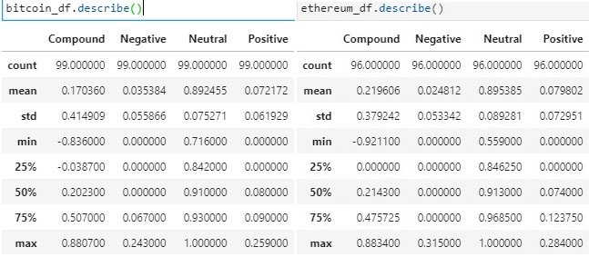
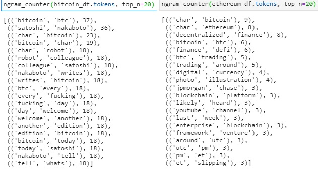

# 12-Natural-Language-Processing

#### Unit 12 NLP Homework - Dan Smith  
* Cryptocurrency News Sentiment : [crypto_sentiment.ipynb](./crypto_sentiment.ipynb)  

  

##### Summary: Sentiment Analysis
1. Bitcoin and Ethereum News Article sentiment: 
> 
2. Observations:
> 1. **Ethereum** had the **highest mean positive score (0.079802)**.**
>     Mean Positive scores:
>       * Bitcoin: 0.072172
>       * Ethereum: 0.079802
> 2. **Ethereum** had the **highest (max) positive score (0.284000)**.
>     Max positive scores:
>       * Bitcoin: 0.259000
>       * Ethereum: 0.284000
> 3. **Ethereum** had the **highest (max) positive score (0.284000)**.
>     Max positive scores:
>       * Bitcoin: 0.259000
>       * Ethereum: 0.284000

##### Summary: Natural Language Processing
1. A tokenizer function was used against bitcoin and ethereum news article content to:
    * tokenize article content using word tokenizer (skipped sentence tokenizer)
    * remove non-alpha 'words' with regex filtering
    * remove standard and manually added stop words
    * lemmatize words to normalize word content
2. 2-word ngrams and counts were created  
>      
3. Top 10 used words and WordClouds were used to visualize word frequency for each:
>    
> 
>    

##### Summary: Named Entity Recognition
1. In this section NER was performed for bitcoin and ethereum and Spacy/Displacy was used to visualize the tags
>    
> 
>    

